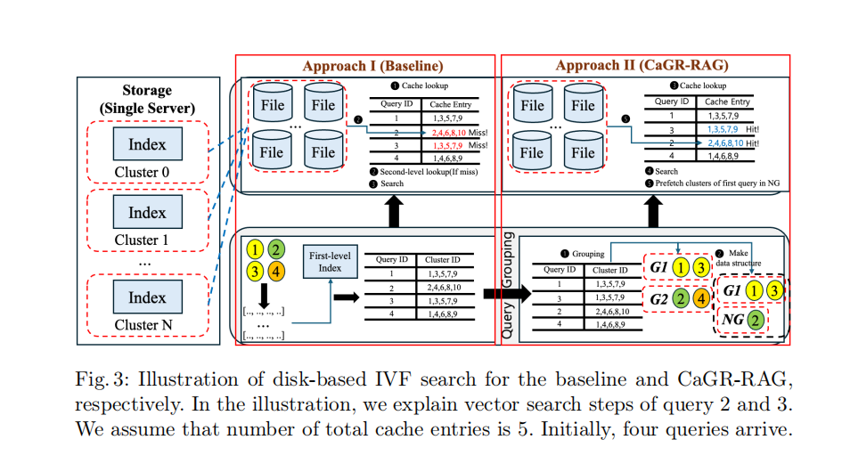

- 用来优化Disk-based的基于IVF算法。用来优化一批查询之间的顺序来实现对于每个查询，要查询的分区尽可能都在内存中。下图是整体结构，可以看到它把查询顺序从1234变成了1324导致查询3的时候内存上正好都存了需要的分区从而不用再重新去磁盘读了，在查询3后，该查2了，它通过prefetch的方式，在查询2前偷偷把2需要的分区加载到内存中，这样查询2的时候也不用再去磁盘读了。

- 查询分组模块：设置一个阈值θ，让这一批查询分一下组，满足每组里的任意两个查询之间的Jaccard相似度都>=θ，Jaccard相似度为一个查询qi对应的所有的分区C(qi)和另一个查询qj的所有分区C(qj)的交集除以它俩的并集。
- 虽然同一个分组之间的缓存命中率有了保障，但是切换分组的时候缓存效果就很差。当查询完当前分组最后一个向量时，就去把下一个分组的第一个查询的所有分区加载到内存中来。
