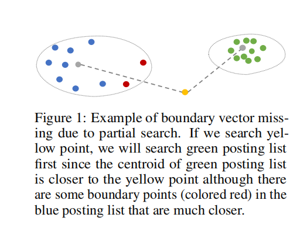
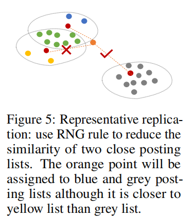

- SPANN是基于IVF的方法。把每个分区(posting list)的最接近质心的真实向量存到内存，每个分区内的所有向量顺序存到硬盘。通过减少硬盘访问次数和提升posting list质量，同时确保了low latency和high recall。
- 建立index的时候，必须限制分区的大小，使得可以通过减少硬盘访问次数和提升posting list质量，同时确保了low latency和high recall。不仅要将数据划分为大量分区，还要平衡各个 分区 的长度。因此采用了**多约束平衡聚类算法**，也就是kmeans的时候加个惩罚项，也就是每个分区的大小与平均分区大小（总向量数/分区个数）的差的平方和再乘以系数λ。但是向量数和分区个数都太大，直接聚类不现实。所以采用了递归的方式，逐层将大分区聚类为小分区，也就是递归的去对分区跑kmeans，跑完了再对每个小分区继续跑kmeans，直到分区大小满足要求。
- 还有边界问题，可能会因为nprobe比较小导致遗漏一些没有访问到的分区，这个分区里可能有一些点在边界而且离查询向量比较近。如下图，如果nprobe为1，对于黄点，它的近邻其实还有两个红点，但是没有访问到。
- 所以要看看能不能把边界分配到多个簇里，但是这样会导致分区大小显著增大。论文提出了一种分配策略，如果边界向量x到多个簇质心ci的距离非常接近，则将其分配给多个最近的簇。也就是看x能否被放到第i个分区的充分必要条件是$dist(x,c_i)<=(1+ε1) * dist(x, c_{i_1})$  ε1是个超参数(有$Dist(x,c_{i_{1}})≤Dist(x,c_{i_{2}})≤⋯≤Dist(x,c_{i_{K}})$ )但是相邻的posting list会出现大量重复向量，所以又引入了RNG的规则，如果$Dist(c_{i_j},x)>Dist(c_{i_{j-1}},Dist(c_{i_j}))$就跳过$i_{j}$簇。直观理解就是尽量把边界向量分配到方向差异大的分区。 

- 为了处理不同难度的查询，提出了查询感知的动态剪枝策略，根据查询与质心之间的距离动态决定是否访问某个 posting list。$dist(x,c_i)<=(1+ε2) * dist(x, c_{i_1})$时才去查第i个分区。
